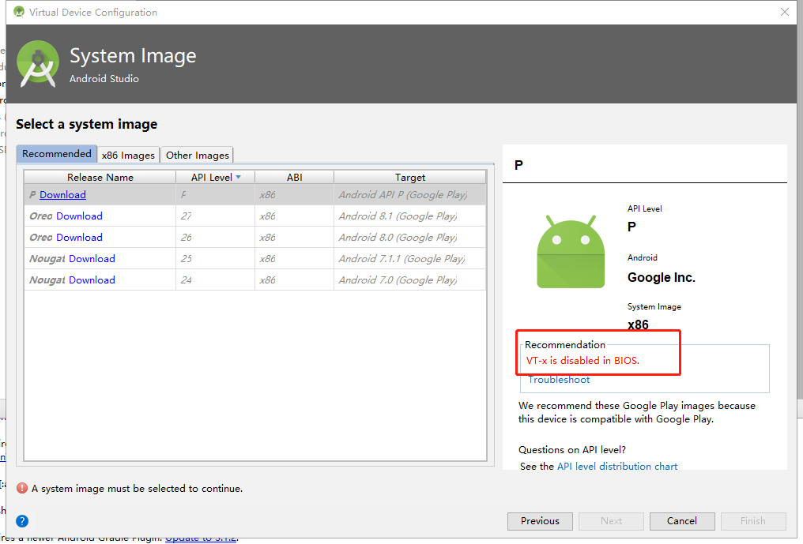
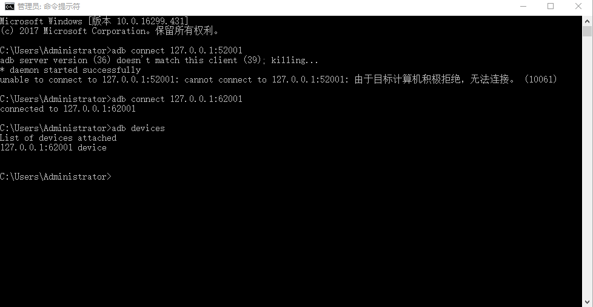
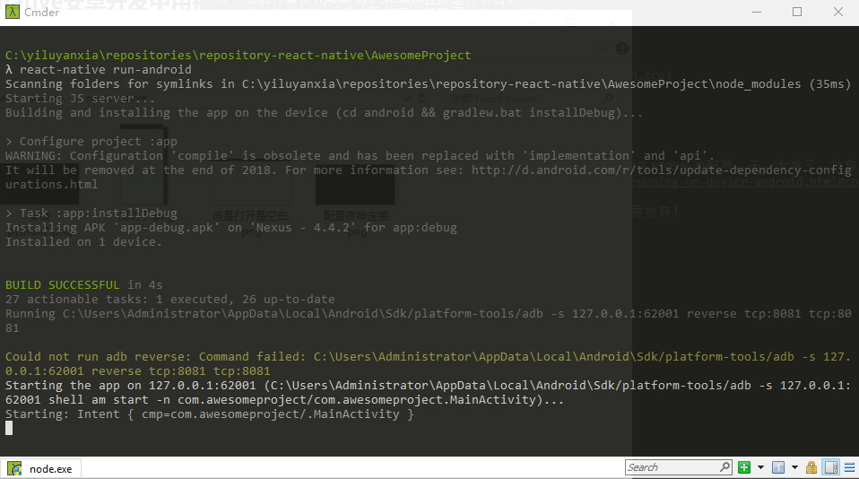
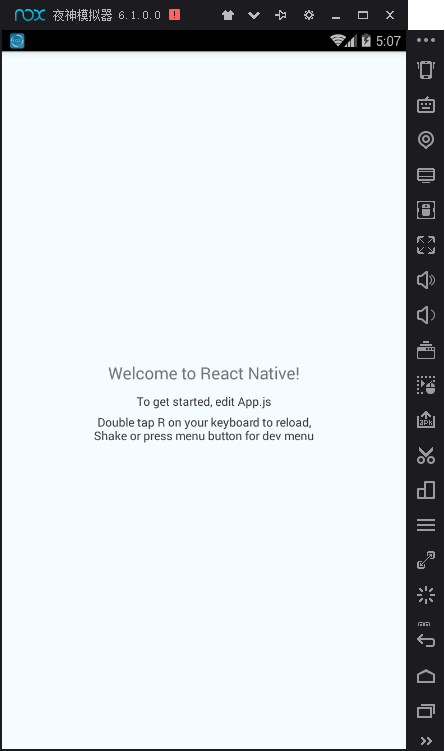
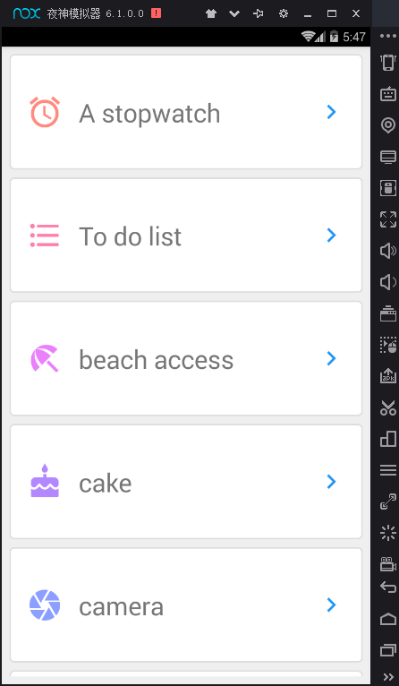
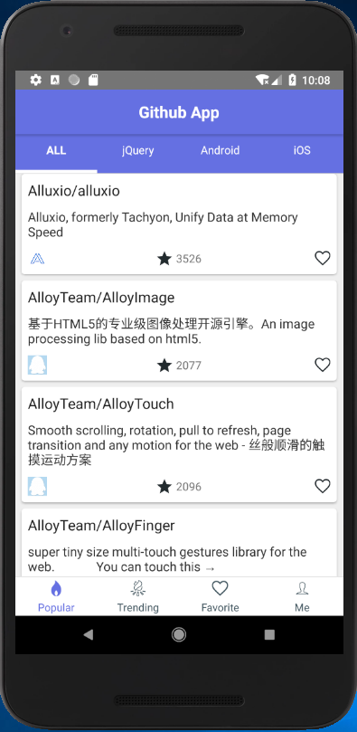

## 前置工作
[react-native官方文档](http://facebook.github.io/react-native/docs/getting-started.html)  
[react-native中文文档](https://reactnative.cn/docs/0.51/getting-started.html#python-2)

### （一）安装必需的软件 

1. Chocolatey

[Chocolatey](https://chocolatey.org/install)的官网


使用管理员打开cmd,输入
```
@"%SystemRoot%\System32\WindowsPowerShell\v1.0\powershell.exe" -NoProfile -InputFormat None -ExecutionPolicy Bypass -Command "iex ((New-Object System.Net.WebClient).DownloadString('https://chocolatey.org/install.ps1'))" && SET "PATH=%PATH%;%ALLUSERSPROFILE%\chocolatey\bin"
```
2. 安装Python 2
 
在cmd中输入

```
choco install python2
```


输入y,不要直接回车。

3. 安装node

```
choco install  nodejs.install 
```
在此之前我已经用nvm安装过node了。

4. 安装jdk8

```
choco install jdk8

```
在此之前我已经去官网下载jdk了。
注意：jdk版本需为8。

5. 安装Yarn、React Native的命令行工具

```
npm install -g yarn react-native-cli
```

设置镜像源
```
yarn config set registry https://registry.npm.taobao.org --global
yarn config set disturl https://npm.taobao.org/dist --global
```

6. 安装Android Studio/夜神模拟器  
这一步是为了使用其模拟器，实际上可忽略。
因为我在使用Android Studio的过程中遇到对我来说非常困难的bug
然后我就放弃了  
所以我又安装了夜神模拟器，虽然使用这个模拟器也遇到问题

7. 初始化项目

```
react-native init AwesomeProject
cd AwesomeProject
react-native run-android
```
然后bug就来了，出现红色的提示  
<!--  -->

我的理解就是模拟器没有关联并启动所导致的。（可能是错误的）


### （二）在模拟器中运行 

然后打算使用Android Studio直接运行项目。
在初步安装完成后按照官网进行配置以完成全部的安装。
打开已存在的项目，注意选择的是项目下的Android文件夹
稍等几分钟运行按钮由灰色变成绿色



原因是 “Vt-x is disabled in BIOS”

遇到问题，首先是想到伟大的网友们。

谷歌搜索到的答案，是手动安装“intelhaxm-android.exe”，然后去BIOS修改配置，天，太难了，放弃！
然后决定[在设备上运行](https://reactnative.cn/docs/0.51/running-on-device-android.html#content)
好麻烦，放弃！
于是安装夜神模拟器，结果还是遇到问题了，心想，再困难也不要放弃！

[详细的步骤](https://www.yeshen.com/blog/reactnativeyeshen/)
1. 打开夜神模拟器
2. 连接模拟器
输入此命令连接模拟器
```
adb connect 127.0.0.1:62001
```

3. 查看是否有连接设备

```
adb devices

```



4. 运行项目
进入到项目，执行命令

```
 react-native run-android
```


5. 解决夜神模拟器红屏  
这时夜神模拟器出现刺眼的红屏  
点击“摇一摇”按钮，在弹出菜单中选择"Dev Settings",点击Debug,输入自己的ip地址和8081

```
192.168.0.xxx:8081
```
6. 关闭模拟器重新执行以上步骤
噔噔噔噔！  
  
终于出来了！  


## 实践
### （一）FlatList长列表
  
根据官方文档的实例，布局还是挺容易的，不过内置的属性和方法，还没有更深入的体验，这对我来说还有一定的难度 *（手动捂脸）* 。    
还加了个react-native-vector-icons，文档也很清楚，根据文档操作基本上没问题，就是各种安卓原生的设置完全看不懂，这就是大项目和小项目的区别，是否受欢迎的原因。

<!-- Failed child context type: Invail child context 'virtualizedCell.cellKey' of type 'number' supplied to 'CellRender', expect 'string'. -->

今天报了一个bug,"很抱歉，AwesomeProject项目已停止运行"，网友给出的答案是模拟器的问题，我想也是，毕竟我还没写bug。
我猜可能是nox的sdk配置与Android studio中的sdk配置不同，
于是尝试将C:\Users\Administrator\AppData\Local\Android\Sdk\platform-tools中的adb.exe文件替换C:\Program Files (x86)\Nox\bin中的nox_adb.exe文件，然后居然就是好了。  
这波操作感觉跟以前的电视剧收不到信号，然后拍拍就好的了情况一样。哇咔咔。

一个警告，暂时不知道如何解决
isMounted(...) is deprecated in plain JavaScript React classes. Instead, make sure to clean up subscriptions and pending requests in componentWillUnmount to prevent memory leaks.

### （二）react-navigation
安卓没有navigation，官方推荐 react-navigation，目前只研究出来如何在TabNavigation里面放入StackNavigator，还不知道如何在StackNavigator插入TabNavigation。  
官网的例子和网友的示例都练习了一遍。


### （三）todo list
尝试编写第一个实际的案例。
一堆bug~  
没心情~  

### （四）GitHubApp
跟着疯老师手把手教学写GitHubApp

初步成型，最终还是启用了BIOS的VT,Android Studio自带的模拟器终于跑起来了，哈哈。
  

其中遇到各种各样的bug，有心情在整理记录。
这是小白的开发日记 *（手动笑哭）* 。


